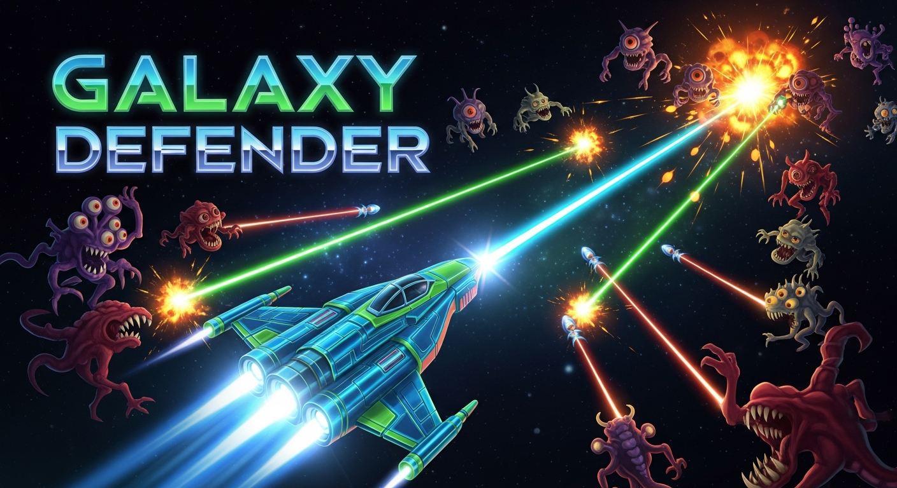

# Galaxy Defender - Chrome Extension Game
Defend Earth from alien invasion! Place towers, upgrade them, and survive endless waves in this action-packed tower defense game. 

## 📦 Install This Game In Your Browser

Galaxy Defender is a fun and addictive tower defense game for Chrome where players defend Earth against alien invaders. Build defensive towers, upgrade your weapons, and survive endless waves of enemies in this space strategy game.

This browser-based tower defense experience combines fast action with strategic gameplay. Every wave becomes more difficult, requiring smart tower placement and quick decision-making.

Game Features:

Tower defense strategy gameplay
Alien invasion battles
Endless survival mode
Upgrade system for towers and defenses
Lightweight and fast Chrome extension
Play directly from your browser

Whether you enjoy arcade games, strategy games, or sci-fi adventures, Galaxy Defender delivers an exciting challenge right inside Chrome.
